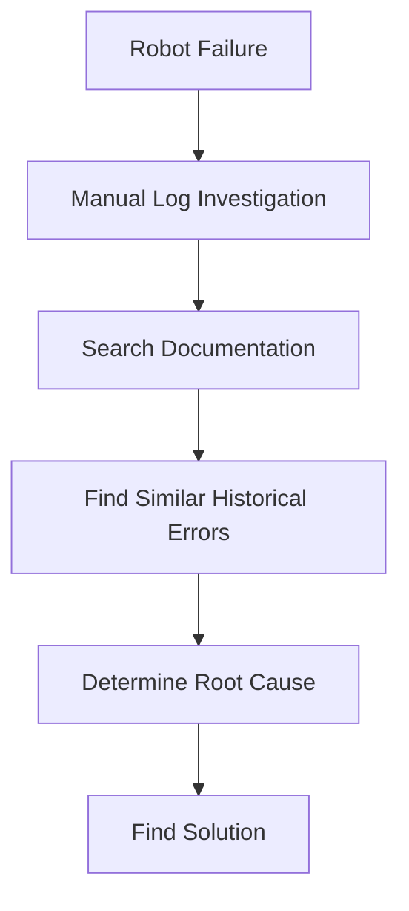
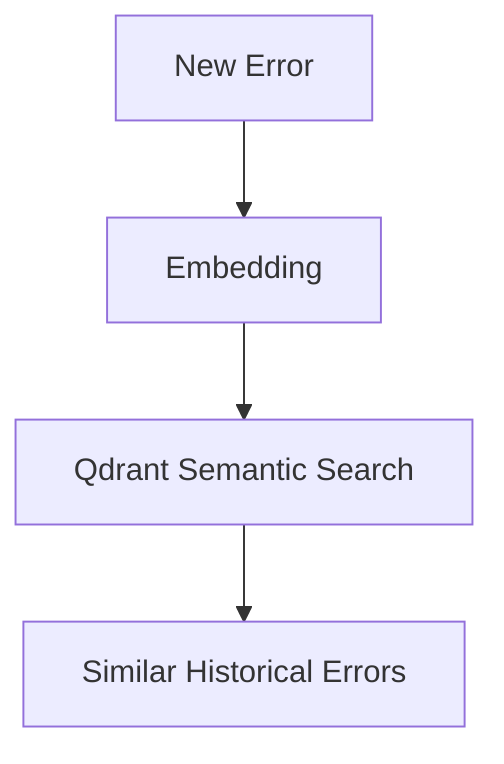
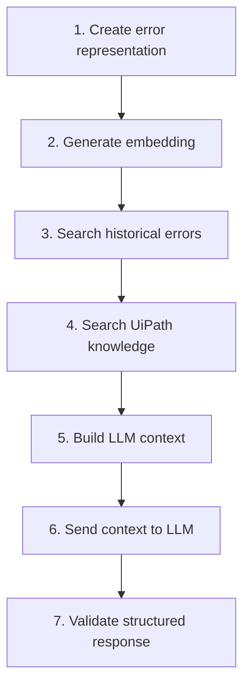
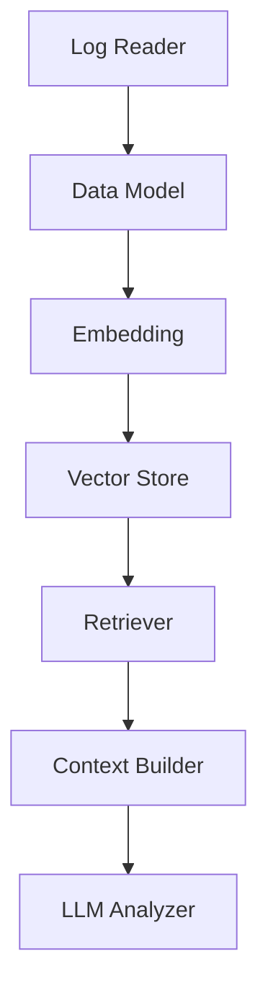

# robots,logs,bugs,fix
This repo is about analyzing robot job logs, finding the root cause, fixing issues, and preventing future failures.

# Robots Logs Bug Fix

A Python CLI proof of concept that uses **Retrieval-Augmented Generation (RAG)** to analyze UiPath robot failures. It retrieves similar historical errors and relevant UiPath documentation, then asks an LLM to produce a structured root-cause analysis.
## Table of Contents

- [Problem](#problem)
- [How RAG Works in This Project](#how-rag-works-in-this-project)
- [Technical Highlights](#technical-highlights)
- [Project Structure](#project-structure)
- [Technology Stack](#technology-stack)
- [Configuration](#configuration)
- [Installation](#installation)
- [Running the Analyzer](#running-the-analyzer)
- [Example](#example)
- [Design Principles](#design-principles)
- [Current Status](#current-status)

## Problem

When a robot fails, engineers typically follow a slow, manual process:



This project automates that workflow.

## How RAG Works in This Project

The system **does not send the error directly to the LLM**. It first retrieves relevant information.

### 1. Historical Error Retrieval

The new error is converted into an embedding vector, which is compared against historical UiPath errors stored in Qdrant.



Current retrieval settings:

| Parameter            | Value  |
| -------------------- | ------ |
| Top-K                | 5      |
| Similarity threshold | 0.20   |
| Distance metric      | Cosine |

### 2. Knowledge Retrieval

The same error is also used to search the UiPath knowledge base, which consists of Markdown documents:

```text
data/knowledge/
├── debugging.md
├── error-handling-guide.md
└── reframework-guide.md
```

The documents are split into sections and chunks before being embedded and stored in Qdrant.

### 3. Context Construction

The `ContextBuilder` combines the following into a structured context for the LLM:

- New error
- Similar historical errors
- Relevant UiPath knowledge

### 4. LLM Analysis

The context is sent to the LLM through **OpenRouter**. The LLM returns structured information:

- Root cause
- Explanation
- Recommended solution
- Prevention
- Confidence

The response is validated using **Pydantic**.

## Technical Highlights

### Embeddings

The project uses [Sentence Transformers](https://www.sbert.net/) with `all-MiniLM-L6-v2`.

- 384-dimensional embeddings
- Semantic representation of error messages
- Used for both historical errors and knowledge chunks
- Suitable for semantic similarity retrieval

### Vector Database

The project uses **Qdrant**. A single Qdrant client manages two collections:

```text
Qdrant
│
├── uipath_errors
│
└── uipath_knowledge
```

#### `uipath_errors`

Stores historical UiPath errors together with their metadata:

- `log_id`
- `timestamp`
- `job_key`
- `process_name`
- `workflow`
- `robot`
- `environment`
- `status`
- `error_code`
- `error_category`
- `severity`
- `error_message`
- `retry_count`
- `queue_item`

#### `uipath_knowledge`

Stores UiPath technical knowledge chunks. Each chunk contains:

- `source`
- `heading`
- `content`
- `embedding`

### LLM Output

The LLM response is represented by the following Pydantic model:

```python
class ErrorAnalysis(BaseModel):
    root_cause: str
    explanation: str
    recommended_solution: str
    prevention: str
    confidence: float
```

The `confidence` value is constrained between `0.0` and `1.0`, which gives downstream applications a predictable structure.

## Project Structure

```text
JobsErrorLogsAnalyzer/
│
├── data/
│   ├── uipath_error_logs.xlsx
│   ├── qdrant/
│   └── knowledge/
│       ├── debugging.md
│       ├── error-handling-guide.md
│       └── reframework-guide.md
│
├── src/
│   └── uipath_agent/
│       │
│       ├── main.py
│       ├── config.py
│       ├── log_reader.py
│       ├── retriever.py
│       ├── context_builder.py
│       ├── analyzer.py
│       ├── knowledge_loader.py
│       ├── knowledge_ingestor.py
│       ├── knowledge_retriever.py
│       ├── ingestion_qdrant.py
│       │
│       ├── models/
│       │   ├── error.py
│       │   └── analysis.py
│       │
│       ├── embeddings/
│       │   └── embedder.py
│       │
│       └── vectorstore/
│           ├── qdrant_store.py
│           └── knowledge_store.py
│
├── tests/
│   ├── __init__.py
│   └── test_log_reader.py
│
├── .env
├── .gitignore
├── pyproject.toml
└── README.md
```

## Technology Stack

| Technology            | Purpose                                 |
| --------------------- | --------------------------------------- |
| Python                | Application development                 |
| Pydantic              | Data validation and structured models   |
| Pandas                | Excel/log data processing               |
| OpenPyXL              | Excel file handling                     |
| Sentence Transformers | Text embeddings                         |
| all-MiniLM-L6-v2      | Embedding model                         |
| Qdrant                | Vector database                         |
| OpenRouter            | LLM API access                          |
| GPT-5.6 Luna          | Error analysis                          |
| Pytest                | Testing                                 |
| Ruff                  | Code quality and linting                |
| python-dotenv         | Environment configuration               |

## Configuration

Create a `.env` file in the project root:

```env
OPENROUTER_API_KEY=YOUR_API_KEY
LOG_FILE_PATH=data/uipath_error_logs.xlsx
KNOWLEDGE_DIR=data/knowledge
```

> [!WARNING]
> API keys should never be committed to Git. The `.env` file is excluded through `.gitignore`.

## Installation

Clone the repository:

```bash
git clone https://github.com/rza4ev/robots-logs-bugs-fix.git
```

Move into the project directory:

```bash
cd robots-logs-bugs-fix
```

Create a virtual environment:

```bash
python -m venv .venv
```

Install the project dependencies:

```bash
pip install -e .
```

For development dependencies:

```bash
pip install -e ".[dev]"
```

## Running the Analyzer

Run the application with:

```bash
python -m uipath_agent.main
```

If the virtual environment cannot be activated because of Windows execution-policy restrictions, use the virtual environment interpreter directly:

```powershell
.\.venv\Scripts\python.exe -m uipath_agent.main
```

## Example

**Example input:**

```text
The Confirm button cannot be found on the screen.
```

**The system performs:**



**Example output:**

```text
========== LLM ANALYSIS ==========

Root Cause:
The target UI element could not be located during execution.

Explanation:
The historical errors indicate that similar failures
were caused by UI elements becoming unavailable or
selectors no longer matching the application state.

Recommended Solution:
Verify the selector and application state before interacting
with the Confirm button. Consider adding appropriate waits
and validating element availability.

Prevention:
Use stable selectors, appropriate synchronization,
and explicit element existence checks.

Confidence:
0.89

===================================
```

> The exact output depends on the retrieved historical errors, knowledge chunks, and LLM response.

## Design Principles

### Separation of concerns

Each component has a specific responsibility:



### Structured data

Pydantic models are used to validate:

- UiPath errors
- LLM analysis results

### Semantic retrieval

The system uses vector similarity instead of relying only on exact keyword matching.

### Knowledge grounding

The LLM receives relevant historical errors and UiPath documentation as context.

### Single Qdrant client

The application uses one shared Qdrant client for the two collections (`uipath_errors` and `uipath_knowledge`). This avoids multiple local Qdrant storage instances accessing the same storage directory.

## Current Status

The current version is a Python CLI-based proof of concept with:

- [x] Historical UiPath error ingestion
- [x] Semantic error retrieval
- [x] UiPath knowledge ingestion
- [x] Semantic knowledge retrieval
- [x] RAG context construction
- [x] LLM-based error analysis
- [x] Structured Pydantic output
- [x] Local Qdrant vector storage
